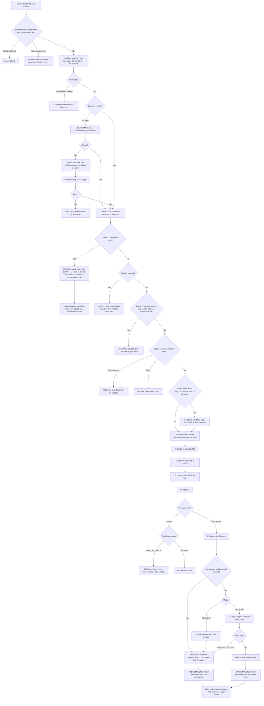

# Conversation flow

Status: DRAFT v1 (2026-09-28). Needs a safety-qa pass before builder implements it.

One design, two modes:
- **REQUEST** (the default for real clients): collect the details and a preferred window, tell the customer the office will confirm, alert the owner. No time is ever promised.
- **BOOKING** (the sales demo, and clients with a maintained calendar): same qualifying, then offer 2-3 open slots from the GHL calendar and book one.

Related files: `system-prompt.md` (bot instructions), `messages.md` (every fixed text, M1-M20), `client-settings-template.md` (placeholders), `test-conversations.md` (safety-qa scripts).

## 1. Flowchart

Emergency and opt-out checks run on **every** inbound message, including after the close and after a handoff. The keyword safety net (section 4) runs in a workflow, separately from the bot.

## 2. Step table

"Counts" means it counts toward the limit of 6 qualifying texts, including M1. The close/confirmation text doesn't count; it's the handoff. Fixed lines like M9 and M16 count only if they carry the next question too.

| Step | Collects | Bot text (demo wording) | Skip when | Counts | Stored in |
|---|---|---|---|---|---|
| M1 | Problem (asked) | "Hi, it's Demo Heating & Air. Sorry we missed your call! What's going on with your heating or AC? Reply STOP to opt out" | Never (except dedupe or DND) | 1 | n/a |
| A | Problem (clarify) | "Got it. What's it doing, or not doing?" | The first answer is clear. Ask at most once | +1 | `rl_problem` |
| B | System type | "Is that your AC, furnace or heat pump? It's fine if you're not sure." | Obvious from the problem | +1 | `rl_system_type` |
| C | Urgency (+ AT-RISK) | "How soon do you need someone: today, or is later this week OK?" | They already said, e.g. "need someone today" | +1 | `rl_urgency`, `rl_at_risk` |
| D | Address + area check | "What's the address where you need service?" (and once, if needed: "What city is that in?") | Already given | +1 | contact address, `rl_area_check` |
| E | Name | "And what name should I put this under?" | Known (they signed a text, or the contact already has a name) | +1 | contact first name |
| F (REQUEST) | Preferred window | "What day and time works best for you? We usually do morning (8am-12pm) or afternoon (12-4pm). The office will confirm." | n/a | +1 | `rl_preferred_window` |
| F (BOOKING) | Booked slot | "I have Tue 8am-12pm, Tue 12-4pm or Wed 8am-12pm. Which works best?" | n/a | +1 | GHL appointment |
| Close (REQUEST) | n/a | M10 (+ heat or cold safety line) | n/a | no | `rl_status = request_sent` |
| Close (BOOKING) | n/a | M11b (+ heat or cold safety line) | n/a | no | `rl_status = booked` |

**Worst case:** M1 + A + B + C + D + E + F = 7 questions. That's why the prompt has a hard cap. After 6 texts it closes with whatever is missing marked, and the office gets the rest when it calls. In practice A or B is almost always skipped (for example, "AC isn't cooling" answers both), so a typical conversation is 5 texts plus the close.

**Typical REQUEST conversation (demo shop, FICTIONAL):**

| # | Who | Text |
|---|---|---|
| 1 | Bot (M1) | Hi, it's Demo Heating & Air. Sorry we missed your call! What's going on with your heating or AC? Reply STOP to opt out |
| | Customer | AC stopped cooling, it's 84 in here |
| 2 | Bot (C) | Sorry to hear that, no fun in this heat. How soon do you need someone: today, or is later this week OK? |
| | Customer | today if possible |
| 3 | Bot (D) | Got it. What's the address where you need service? |
| | Customer | 1418 Example St, Conway |
| 4 | Bot (E) | Thanks! And what name should I put this under? |
| | Customer | Mike |
| 5 | Bot (F) | What day and time works best for you? We usually do morning (8am-12pm) or afternoon (12-4pm). The office will confirm. |
| | Customer | today afternoon or tomorrow morning |
| 6 | Bot (close) | Thanks, Mike! I've sent this to the Demo Heating & Air team. The office will reach out to confirm a time. Reply here if anything changes. If anyone at home feels sick from the heat, call 911. |

The owner then gets M6a: `NEW JOB REQUEST - URGENT`.

## 3. Urgency rules

| Label | When | What changes |
|---|---|---|
| EMERGENCY | Any Rule 1 trigger | M2 + M4. Never qualified or booked by the bot |
| URGENT | No heat or no cooling at all, a water leak (not near electrical), the customer says today or ASAP, or AT-RISK | The owner alert is labeled URGENT. If `{{after_hours_service}}` = YES and it's after hours, the alert also goes to `{{oncall_phone}}` (the workflow decides by time, not the bot). **The customer is never told a faster time** |
| STANDARD | Works poorly, can wait a day or two | Normal alert |
| ROUTINE | Tune-up, estimate, thermostat install | Normal alert |
| AT-RISK flag | Elderly, sick, disabled, pregnant, a baby or small child, medical equipment | Added to any label. The customer is told "I'm marking this as a priority". If that person is sick now, the bot says call 911 |

## 4. GHL build plan (for builder, after safety-qa passes)

All names start with `RL-` so they're easy to find. Every item marked [VERIFY IN GHL] must be checked in the live GHL account before building. If a feature doesn't exist, tell the CEO before working around it.

| Workflow | Trigger | Does |
|---|---|---|
| `RL-MissedCall` | Missed or unanswered inbound call on the client's GHL number. [VERIFY IN GHL] the exact trigger name ("Call Status" = no-answer/missed?) and whether forwarded calls count as missed | 1) If the contact has DND or `rl-optout`: stop. 2) If tag `rl-active` was added within `{{dedupe_window}}`: send M6e to owner and stop. 3) Send M1. 4) Tag `rl-active`, and turn the bot on for this contact. [VERIFY IN GHL] per-contact bot status. 5) If delivery failed, send M5. [VERIFY IN GHL] delivery-failure detection |
| `RL-EmergencyNet` | Customer replied, and the message contains any keyword below. [VERIFY IN GHL] whether "contains phrase" matching is case-insensitive and accepts a list | 1) If tag `rl-emergency` was added in the last 10 min: skip to step 4. 2) Send M2 (the Spanish version if a Spanish keyword matched). 3) Turn the bot OFF for the contact and tag `rl-emergency`. 4) Send M4 to on-call and owner. 5) Wait 5 min. If no human has replied in the conversation, send M4 to backup. [VERIFY IN GHL] 6) Remove from all follow-up workflows |
| `RL-Emergency` | Bot EMERGENCY action | Same as RL-EmergencyNet steps 3-6. It does **not** send M2 again, because the bot already sent it |
| `RL-EmergencyFollowup` | Customer replied, and the contact has `rl-emergency` | Send M3 at most once per 10 min until a human replies. [VERIFY IN GHL] |
| `RL-OptOut` | Bot OPT-OUT action, **and** GHL's native STOP handling | Set DND (SMS), tag `rl-optout`, bot OFF, and remove from all workflows. Send M14 only if GHL doesn't already send one. [VERIFY IN GHL] |
| `RL-Handoff` | Bot HUMAN HANDOVER | Send M6d to owner. Bot OFF. Remove from follow-ups |
| `RL-JobAlert` | Bot JOB COMPLETE | Send M6a (REQUEST) or M6b (BOOKING) to owner (+ email). If URGENT, after hours and `{{after_hours_service}}` = YES, also send to on-call. Tag `rl-job-request` or `rl-booked`. Move to the pipeline stage "New request" or "Booked". Remove from follow-ups |
| `RL-JobUpdate` | Bot JOB UPDATE | Send "UPDATE from [phone]: [message]" to owner |
| `RL-Followups` | Starts when M1 is sent, and restarts after each bot text | Wait 15 min for a reply. If none, and it's outside quiet hours: send M7a. At 30 min with no reply, send M6c to owner if there's anything to report. Wait until `{{followup_morning_time}}` the next day. If still no reply: send M7b. Then tag `rl-unresponsive` and end. Exit immediately on any reply or on tags `rl-emergency`, `rl-optout`, `rl-handoff`, `rl-job-request`, `rl-booked`, `rl-spam` or `rl-wrong-number`. [VERIFY IN GHL] "wait for reply with timeout" and goal/exit conditions |

### Emergency keyword net (for `RL-EmergencyNet`)

This list is deliberately narrow, to avoid false alarms on normal HVAC words. The bot catches everything else by meaning (Rule 1).

**Include** (case-insensitive "contains"):
- English: `smell gas`, `smells like gas`, `smelling gas`, `gas smell`, `gas leak`, `leaking gas`, `rotten egg`, `carbon monoxide`, `monoxide`, `co alarm`, `co detector`, `co2 alarm`, `co2 detector`, `spark`, `smoke`, `on fire`, `caught fire`, `flames`, `burning smell`, `smells like burning`, `smell burning`, `something burning`, `burnt smell`, `electrical smell`, `melting`
- Spanish: `huele a gas`, `olor a gas`, `fuga de gas`, `monoxido`, `monóxido`, `chispa`, `humo`, `fuego`, `llamas`, `olor a quemado`, `huele a quemado`

**Deliberately excluded** (too many false alarms, so the bot handles them in context):
- `gas`: "gas furnace" is normal
- `co`: it matches "Conway", "cold" and "company"
- `fire`: "furnace won't fire" is normal HVAC slang
- `burning`: "burning up in here" means it's hot
- `water` / `flood`: condensate leaks are common. The bot judges whether it's near electrical

**Known, accepted false positive:** "I don't smell gas, just no heat" contains `smell gas`, so it gets the safety script. We accept this: one unnecessary safety text costs much less than one missed gas leak. The owner alert shows the customer's exact words, so on-call can tell quickly. The same goes for "smoke detector is chirping", which is often just a low battery. We still send the script, because the bot can't tell a chirp from a real alarm and must not diagnose.

**Known duplicate:** if both the keyword net and the bot catch the same message, the customer may get M2 twice. [VERIFY IN GHL] whether a workflow that turns the bot off can stop a bot reply already in progress. We accept the duplicate: two copies of a safety text is a small cost. M4 is de-duplicated by the 10-minute tag check.

## 5. [VERIFY IN GHL] checklist

These are things we don't know about GHL's current product. Builder checks each one in a live account and records the answer here before building.

1. Where the bot prompt goes (Bot Goals / Prompt field), and its **character limit**. The filled prompt is roughly 12,000 characters.
2. Whether Custom Values like `{{custom_values.x}}` work inside the bot prompt.
3. Autopilot vs Suggestive mode names, and restricting the bot to SMS only.
4. The exact action names (Trigger Workflow, Update Contact Field, Appointment Booking, Stop Bot, Human Handover), and whether each takes a plain-English "when to use" description.
5. Whether Human Handover can also start a workflow, or needs a separate Trigger Workflow action.
6. Whether the bot can write custom fields reliably, and whether it overwrites existing contact data.
7. Whether the bot sees the workflow-sent M1 in the conversation history, so it knows the problem was already asked.
8. Whether the bot knows the current date and time. (The design doesn't depend on it.)
9. The missed-call trigger name, and whether forwarded, unanswered calls fire it.
10. Delivery-failure detection for landlines (M5). The fallback is a digest.
11. Per-contact bot on/off from a workflow.
12. Whether "customer replied contains phrase" matching is case-insensitive and takes a list.
13. Whether a workflow can stop a bot reply already in progress (the M2 duplicate).
14. Detecting "a human replied" for the emergency escalation to backup.
15. Rate-limiting M3 (at most one per 10 min).
16. Native STOP handling: which keywords it covers (STOP, STOPALL, UNSUBSCRIBE, CANCEL, END, QUIT, and Spanish ones), whether it auto-sends a confirmation, and whether it sets DND.
17. Whether a workflow can set DND on a contact (natural-language opt-out like "stop texting me").
18. Appointment Booking action: how many slots it offers, whether we control its wording, whether the count can be capped, and its "max messages" setting (reported range 5-25).
19. "Wait for reply with timeout", plus exit and goal conditions in workflows (follow-ups).
20. Whether a workflow can place an automated voice call to on-call for emergencies.
21. Whether demo texting to our own test phones needs a registered A2P number.
22. How the bot handles MMS (photos, voice notes).
23. Merge-tag names for contact and custom fields in workflow SMS.
